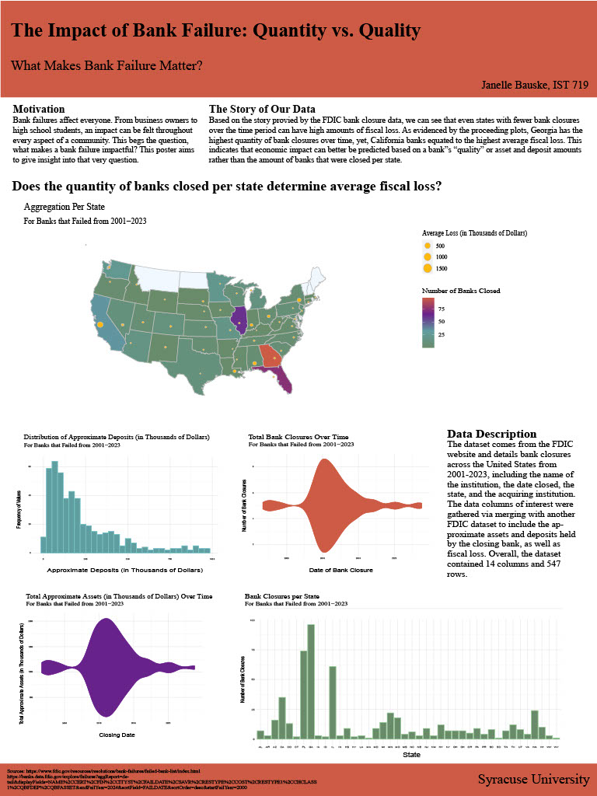

# Project Overview  
• Analyzed FDIC bank closure data (2001–2023) to compare the frequency of failures with the magnitude of financial losses.  
• Merged multiple FDIC datasets, constructing a final dataset of 547 records across 14 variables, including geographic, financial, and timeline attributes.  
• Conducted statistical analysis and created visualizations in RStudio, refining them with Adobe Illustrator for presentation.  
• Presented findings at iSchool’s Poster Day 2024, showcasing insights on the implications of bank failure patterns.  

# File Overview  

## Data  
bank-data.csv, banklist.csv, bfb-all-data.csv: Raw data files from the FDIC website to be read in via "jbauske_final_proj.R".  

## Project Files
1. jbauske_wip_report: A proposal report describing the data sources, project goals, and initial EDA on the combined data.  
2. jbauske_final_proj.R: R file containing the code for data merging, analysis, and visualization creation.  
2. jbauske_final_proj_graphs2: A PDF file containing all of the exported visualizations for the project.  
2. jbauske_poster: The final poster for the project including a written analysis of findings, the data story for the project, and all of the supporting visualizations.  

# Final Poster  

