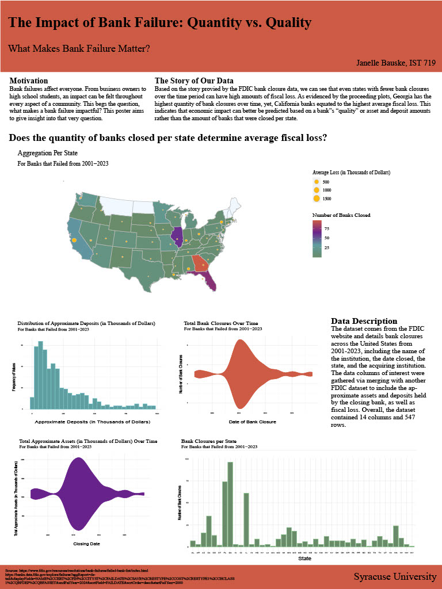

# File Overview  
## Data  
bank-data.csv, banklist.csv, bfb-all-data.csv: Raw data files from the FDIC website to be read in via "jbauske_final_proj.R".  
## Project Files
1. jbauske_wip_report: A proposal report describing the data sources, project goals, and initial EDA on the combined data.  
2. jbauske_final_proj.R: R file containing the code for data merging, analysis, and visualization creation.  
2. jbauske_final_proj_graphs2: A PDF file containing all of the exported visualizations for the project.  
2. jbauske_poster: The final poster for the project including a written analysis of findings, the data story for the project, and all of the supporting visualizations.  
# Final Poster  

